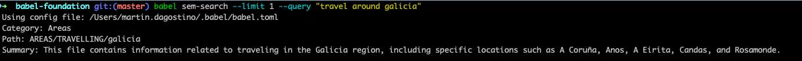
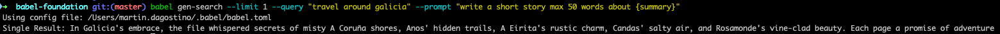

# 🛠️ Babel CLI

(This project is under Babel Foundation initiative. You can read the manifest [here](https://github.com/margostino/babel-foundation))

`babel-cli` is a command-line tool for searching and indexing and syncing Babel assets. It supports semantic and generative search powered by [Weaviate Vector DB](https://weaviate.io/).

<p align="center">
  
</p>

## Demo

[](https://youtu.be/dkvbfGB1qRE)

## Features

- **Index**: Index babel assets.
- **Sync**: Sync metadata. Walk through Babel assets and sync metadata.
- **Search**: [Semantic](https://weaviate.io/developers/academy/py/starter_text_data/text_searches/semantic) and [Generative](https://weaviate.io/developers/weaviate/modules/reader-generator-modules/generative-openai) Search.

## Commands

### Index

```bash
babel-cli metadata init
```

### Sync

```bash
babel-cli metadata sync
```

### Semantic Search

```bash
babel-cli sem-search --limit 1 --query "vacation plan"
```



### Generative Search

```bash
babel-cli gen-search --limit 1 --query "vacation plan" --prompt "write a short story max 20 words about {summary}"
```



### TODO

- [x] Vector DB (weaviate) integration
- [x] Initialize database and home directory
- [x] Initialize metadata
- [x] Sync metadata
- [x] Stats reporting
- [ ] CRUD commands (basic)
- [ ] Tag implementation
- [ ] Sync with remote (Git)
- [ ] BabelQL implementation?
- [ ] Workflow implementation: inbox -> project -> area -> resource -> archive
- [ ] Share implementation
- [ ] Knowledge graph generation
- [ ] Search implementation (local and remote)
  - By similarity
  - By tags
  - By parameters (name, category, etc.)
- [ ] Testing Testing Testing
